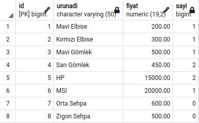

# first-homework

## Introduction
In this project, User and Product Comment tables were added in addition to the application in the course. 
PostgreSQL was used as the database. Since it was started as a continuation of the repo in the course, 
the names were defined in Turkish.

## Answers

#### Q2- Write a method that lists comments for a product.
When the required sql query was written, the following output was obtained: 

#### Q3- Write a method that shows the number of comments made on the products.
When the required sql query was written, the following output was obtained: 

#### Q4- Write a method that lists comments made by a user.
When the required sql query was written, the following output was obtained: 

